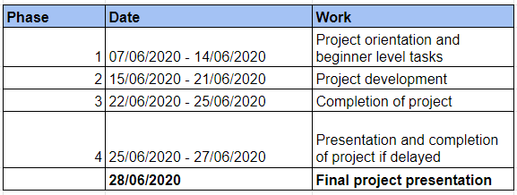

# **Interestship 1.0**

 - This user manual is useful for all the projects. This repo is General for all the projects. The duration of clique **Interestship 1.0**  is from 7th June 2020 to 27th June 2020. 
 - All the projects has different repositories, naming wise. All the team members should work on assigned projects and push the codes to git.
 - Your mentor will review your code and give suggestions if required.
 - This Interestship program is divided into three phases, all the mentors and students should work accordingly.

